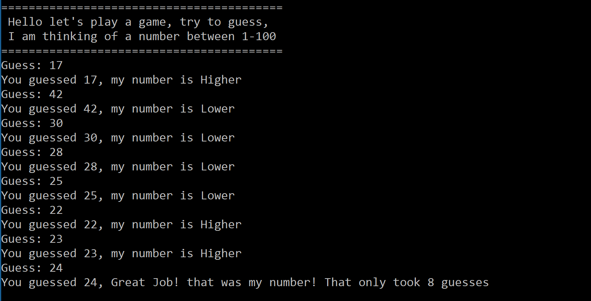

# NumberGuess
In this challenge you are being tasked with building out a Console Application where the user must guess a random number chosen by the computer between 1-100 inclusive. Each time the user types in a guess the application should be able to notify the user if they need to guess higher, lower, or catch bad input and ask for a valid number. 

At the end of the game the user should be given the number of guesses required to find the correct number.

## Legal Overview

The content under the CodeWorks®, LLC Organization and all of the individual repos are soley intended for use by CodeWorks Instruction to deliver Educational content to CodeWorks Students.

---

## Copyright

© CodeWorks® LLC, 2021. Unauthorized use and/or duplication of this material without express and written permission from CodeWorks, LLC is strictly prohibited.

